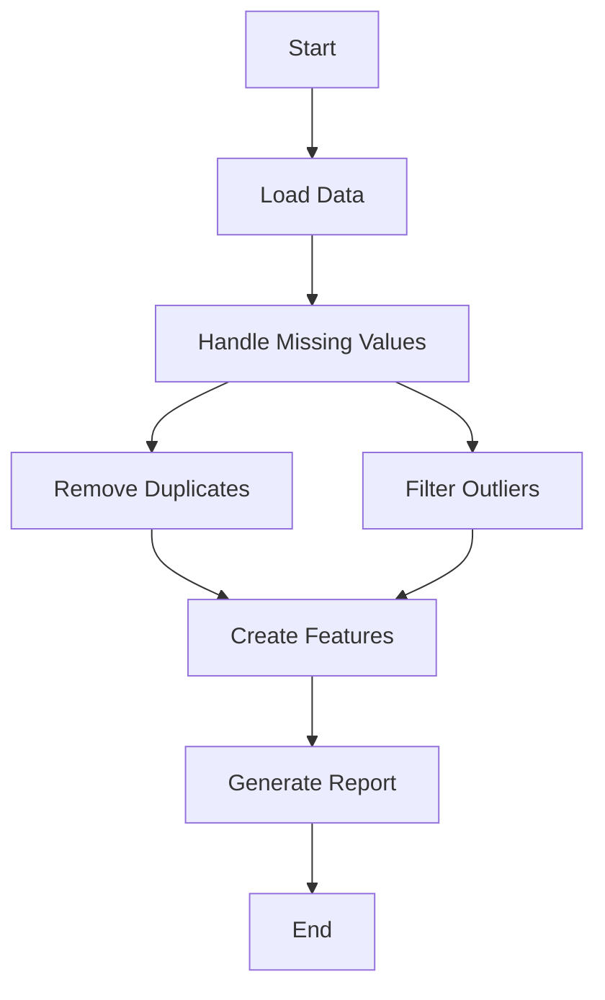

# MLOps Pipeline - Predicción de Deserción Estudiantil


## 📋 Descripción

Este proyecto implementa un pipeline MLOps completo para la predicción de deserción estudiantil utilizando Apache Airflow como orquestador. El sistema automatiza el procesamiento de datos, entrenamiento de modelos y generación de reportes mediante contenedores Docker.

## 🏗️ Arquitectura

```
├── dags/                    # DAGs de Airflow
│   └── mlops_dag.py        # Pipeline principal de ML
├── src/                    # Código fuente
│   └── utils/
│       └── processing.py   # Funciones de procesamiento
├── volumes/                # Volúmenes persistentes
│   └── airflow/           # Configuración de Airflow
├── docker-compose.yml      # Orquestación de servicios
├── Dockerfile             # Imagen personalizada
└── requirements.txt       # Dependencias Python
```

## 🚀 Características

- **Pipeline Automatizado**: Procesamiento completo de datos desde ingesta hasta predicción
- **Procesamiento Paralelo**: Manejo simultáneo de duplicados y outliers
- **Containerización**: Despliegue consistente con Docker
- **Monitoreo**: Interface web de Airflow para seguimiento
- **Escalabilidad**: Arquitectura modular y extensible

## 🛠️ Tecnologías

- **Apache Airflow 2.9.2**: Orquestación de workflows
- **Python 3.9+**: Lenguaje principal
- **Docker & Docker Compose**: Containerización
- **pandas**: Manipulación de datos
- **scikit-learn**: Machine Learning
- **MySQL 8.0**: Base de datos (opcional)

## ⚙️ Instalación

### Prerrequisitos

- Docker >= 20.10
- Docker Compose >= 2.0
- Git

### Configuración del Entorno

1. **Clonar el repositorio**:
```bash
git clone <repository-url>
cd mlops-pipeline
```

2. **Preparar la estructura de datos**:
```bash
# Crear directorio de datos (debe contener dataset.csv)
mkdir -p ../egi-control/data/raw
# Copiar tu dataset a ../egi-control/data/raw/dataset.csv
```

3. **Levantar los servicios**:
```bash
docker-compose up -d
```

4. **Verificar la instalación**:
- Acceder a Airflow UI: http://localhost:8080
- Credenciales por defecto: `admin/admin`

## 🎯 Uso

### Ejecutar el Pipeline

1. **Acceder a Airflow UI**: http://localhost:8080
2. **Activar el DAG**: `mlops_dropout_prediction`
3. **Trigger manual** o esperar ejecución programada (diaria)

### Estructura del Pipeline

El DAG `mlops_dropout_prediction` ejecuta las siguientes tareas:



#### Tareas del Pipeline:

1. **load_data**: Carga el dataset desde `/opt/airflow/data/raw/dataset.csv`
2. **handle_missing_values**: Imputa valores faltantes
3. **remove_duplicates**: Elimina filas duplicadas
4. **filter_outliers**: Filtra outliers usando Z-score (threshold=3)
5. **create_features**: Crea características derivadas (`total_score`)
6. **generate_report**: Genera reporte de limpieza

### Archivos Generados

```
/opt/airflow/data/
├── raw/
│   └── dataset.csv              # Dataset original
├── temp/                        # Archivos intermedios
│   ├── dataset_temp.csv
│   ├── step1_missing_handled.csv
│   ├── step2_duplicates_removed.csv
│   └── step2b_outliers_filtered.csv
└── processed/                   # Resultados finales
    ├── cleaned_data.csv         # Dataset limpio
    └── cleaning_report.txt      # Reporte de métricas
```

## 📊 Configuración

### Variables de Entorno

Modificar en `docker-compose.yml`:

```yaml
environment:
  - AIRFLOW__CORE__EXECUTOR=SequentialExecutor  # Para producción usar CeleryExecutor
  - AIRFLOW__CORE__LOAD_EXAMPLES=false
  - AIRFLOW__CORE__FERNET__KEY=<your-key>
```

### Personalización del Pipeline

#### Modificar rutas de datos:
```python
# En dags/mlops_dag.py
RAW_DATA_PATH = "/ruta/a/tu/dataset.csv"
TEMP_DIR = "/ruta/temporal"
PROCESSED_DIR = "/ruta/procesados"
```

#### Ajustar parámetros de limpieza:
```python
# Threshold para outliers
def filter_numeric_outliers(df, threshold=3):  # Cambiar threshold
```

#### Programación del DAG:
```python
# En la definición del DAG
schedule_interval="@daily"  # Cambiar frecuencia
```

## 🔧 Desarrollo

### Agregar nuevas tareas

1. **Crear función de procesamiento**:
```python
def nueva_tarea():
    # Tu lógica aquí
    pass
```

2. **Agregar PythonOperator**:
```python
nueva_task = PythonOperator(
    task_id="nueva_tarea",
    python_callable=nueva_tarea
)
```

3. **Definir dependencias**:
```python
tarea_anterior >> nueva_task >> tarea_siguiente
```

### Funciones Utilitarias

Agregar funciones reutilizables en `src/utils/processing.py`:

```python
def mi_funcion(**kwargs):
    input_path = kwargs['input_path']
    output_path = kwargs['output_path']
    # Procesamiento
```

## 🐛 Troubleshooting

### Problemas Comunes

**Error: "No such file or directory"**
```bash
# Verificar que el dataset existe
ls -la ../egi-control/data/raw/dataset.csv
```

**Airflow UI no carga**
```bash
# Reiniciar servicios
docker-compose restart airflow
```

**Error de permisos**
```bash
# Ajustar permisos de volúmenes
sudo chown -R $USER:$USER volumes/
```

**Ver logs detallados**
```bash
# Logs de Airflow
docker-compose logs airflow

# Logs del scheduler
docker-compose logs airflow-scheduler
```

### Comandos Útiles

```bash
# Ver estado de contenedores
docker-compose ps

# Ejecutar comandos en Airflow
docker exec -it airflow bash

# Limpiar volúmenes
docker-compose down -v

# Reconstruir imágenes
docker-compose build --no-cache
```

## 📈 Monitoreo

### Métricas del Pipeline

- **Duración**: Tiempo total de ejecución
- **Filas procesadas**: Antes/después de cada etapa
- **Valores faltantes**: Cantidad manejada
- **Outliers**: Número filtrado
- **Duplicados**: Cantidad removida

### Alertas

Configurar notificaciones en `default_args`:
```python
default_args = {
    'email_on_failure': True,
    'email_on_retry': False,
    'email': ['admin@empresa.com'],
}
```

## 🤝 Contribución

1. Fork el proyecto
2. Crear branch de feature (`git checkout -b feature/nueva-funcionalidad`)
3. Commit cambios (`git commit -am 'Agregar nueva funcionalidad'`)
4. Push al branch (`git push origin feature/nueva-funcionalidad`)
5. Crear Pull Request

**Nota**: Asegúrate de tener los datos necesarios en la ruta especificada antes de ejecutar el pipeline. Para preguntas o problemas, crear un issue en el repositorio.
